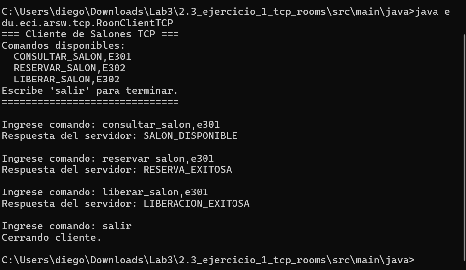
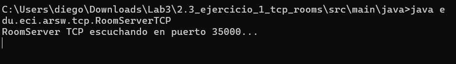

# Room Management System with TCP Sockets

Escuela Colombiana de Ingeniería Julio Garavito

Arquitecturas de Software - ARSW

---

## Exercise Description

This project implements a low-level Client-Server architecture to manage university study room reservations. The server maintains an in-memory record of four rooms: E301, E302, E303, and E304. It handles client requests through a direct TCP channel without any standardized protocol in between.

The most important feature of this exercise is that the developer is responsible for inventing, documenting, and enforcing their own communication protocol. There is no framework or library defining how messages are exchanged: everything is transmitted as plain text over the byte stream provided by the socket.

---

## What Was Asked

The exercise required implementing a TCP server to manage study rooms keeping data solely in memory. It had to support three operations: checking a room's status, reserving it if available, and releasing it if reserved. Communication had to be through text messages like CONSULTAR_SALON,E303, and responses had to be text strings like SALON_DISPONIBLE or RESERVA_EXITOSA. Errors had to be handled by returning ERROR_OPERACION_INVALIDA or ERROR_SALON_NO_EXISTE as appropriate.

---

## Project Structure

```text
2.3_ejercicio_1_tcp_rooms/
├── src/
│   └── main/
│       └── java/
│           └── edu/eci/arsw/tcp/
│               ├── Room.java
│               ├── RoomRepository.java
│               ├── RoomServerTCP.java
│               └── RoomClientTCP.java
└── README.md
```

---

## How the Architecture Works

The pure TCP model operates on a bidirectional byte stream paradigm. When the server executes `serverSocket.accept()`, the process blocks, actively waiting until a client attempts to connect. At that moment, Java creates a `Socket` object representing the exclusive communication channel with that specific client.

Two streams are wrapped around that socket: a `BufferedReader` to read incoming text lines from the client and a `PrintWriter` to write the response back. The server reads a single line of text, processes it, returns another line of text, and then closes the connection.

The invented protocol follows the format `ACTION,ROOM_ID`. The server splits that string using the comma as a delimiter, extracts the action and the room identifier, and looks it up in the in-memory repository to execute the operation. If any part of the message is malformed, the server responds with a standard error message.

The `processRequest` method is marked with `synchronized`, ensuring that if multiple threads attempt to process requests simultaneously, only one can modify the rooms' state at a time. This prevents race conditions where two clients might reserve the same room simultaneously.

---

## Class by Class Analysis

### Room

Represents the fundamental entity of the system: a physical room. It contains only the room identifier as a string and a boolean indicating its availability. It is a pure data object with no business logic.

### RoomRepository

Acts as the simulated in-memory database. Upon initialization, it creates a `HashMap` and populates it with the four required rooms. It exposes a single `findById` method to find a room by its identifier. This separation ensures that the server and client never manipulate the data structure directly but always pass through the repository.

### RoomServerTCP

The entry point for the server. It starts a `ServerSocket` on port 35000 and enters an infinite loop waiting for connections. Every time a client connects, it creates the read and write streams, reads the message, delegates it to the `processRequest` method, sends the response, and closes the connection. The `processRequest` method contains all the business logic: splitting the message, identifying the action, finding the room, and returning the appropriate result.

### RoomClientTCP

Allows the user to interact with the server from the console. It creates a `Scanner` on standard input to capture user input, opens a `Socket` to localhost on port 35000, sends the message, and blocks waiting for the server's response. Upon receiving the response, it prints it to the console and loops until 'salir' is entered.

---

## How to Run

First, compile all files in the package:

```bash
cd 2.3_ejercicio_1_tcp_rooms/src/main/java
javac edu/eci/arsw/tcp/*.java
```

Then, start the server in a terminal:

```bash
java edu.eci.arsw.tcp.RoomServerTCP
```

In a different terminal, start the client:

```bash
java edu.eci.arsw.tcp.RoomClientTCP
```

The client will wait for commands. Some valid examples are:

```text
CONSULTAR_SALON,E301
RESERVAR_SALON,E302
LIBERAR_SALON,E302
CONSULTAR_SALON,E999
```



