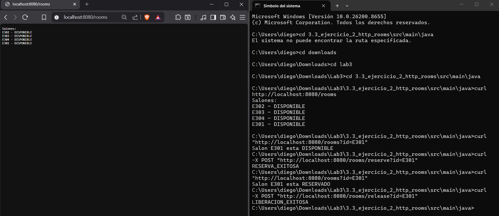

# Sistema de Gestión de Salones vía HTTP

Escuela Colombiana de Ingeniería Julio Garavito

Arquitecturas de Software - ARSW

---

## Descripción del Ejercicio

Este proyecto es la evolución directa del ejercicio anterior de Sockets TCP. La diferencia fundamental es que ahora el transporte de datos no es un protocolo inventado, sino el protocolo HTTP estándar, el mismo que usan los navegadores web para comunicarse con cualquier página en internet. Esto transforma el servidor en algo que cualquier herramienta estándar puede consumir, sin necesidad de un cliente escrito específicamente para este sistema.

---

## Qué Pedía el Ejercicio

El ejercicio solicitaba reimplementar el sistema de gestión de salones pero usando HTTP nativo de Java, es decir, sin frameworks como Spring Boot ni Jersey. Se debían exponer las siguientes rutas HTTP, donde GET /rooms lista todos los salones, GET /rooms con el parámetro id consulta un salón específico, POST /rooms/reserve con el parámetro id reserva un salón, y POST /rooms/release con el parámetro id libera un salón reservado. Las respuestas debían incluir códigos de estado HTTP adecuados como 200, 400 o 404.

---

## Estructura del Proyecto

```
3.3_ejercicio_2_http_rooms/
├── src/
│   └── main/
│       └── java/
│           └── edu/eci/arsw/http/
│               ├── Room.java
│               ├── RoomRepository.java
│               └── RoomHttpServer.java
└── README.md
```

---

## Cómo Funciona la Arquitectura

El protocolo HTTP añade una capa de semántica sobre TCP. Ya no se envía solo un texto plano: se envía un mensaje estructurado que incluye un verbo como GET o POST, una ruta como /rooms/reserve, parámetros opcionales en la URL, y una respuesta que además del cuerpo incluye un código de estado numérico.

El servidor usa la clase HttpServer de la biblioteca estándar de Java. Esta clase ya se encarga internamente de aceptar conexiones TCP, parsear el mensaje HTTP entrante, y entregar al desarrollador un objeto HttpExchange que contiene toda la información de la petición de forma organizada. El desarrollador solo debe implementar la interfaz HttpHandler con la lógica de enrutamiento y respuesta.

Esto representa una mejora arquitectónica significativa sobre el ejercicio TCP: el servidor es ahora interoperable con cualquier cliente HTTP del mundo, sea un navegador, la herramienta curl desde la terminal, Postman, o cualquier aplicación construida en cualquier lenguaje de programación.

---

## Análisis Clase por Clase

### Room y RoomRepository

Son idénticos al ejercicio anterior. El modelo de datos y la lógica de almacenamiento en memoria no cambian porque el dominio del problema es el mismo. Lo único que evoluciona es la capa de comunicación.

### RoomHttpServer

Es el punto de entrada del servidor. Utiliza HttpServer.create para atar el servidor al puerto 8080 y registra un contexto en la ruta /rooms que apunta a un manejador interno. El manejador implementa la interfaz HttpHandler y dentro del método handle extrae de la petición el método HTTP, la ruta completa y los parámetros de la query string.

La lógica de enrutamiento usa comparaciones simples: si el método es GET y la ruta es /rooms, devuelve la lista de salones. Si el método es POST y la ruta es /rooms/reserve, intenta reservar el salón cuyo id viene en los parámetros. Para cada caso se escribe la respuesta con un código de estado apropiado y el texto del resultado en el cuerpo de la respuesta HTTP.

---

## Cómo Ejecutar

Compila todos los archivos del paquete:

```bash
cd 3.3_ejercicio_2_http_rooms/src/main/java
javac edu/eci/arsw/http/*.java
```

Inicia el servidor:

```bash
java edu.eci.arsw.http.RoomHttpServer
```

El servidor quedará escuchando en el puerto 8080. Puedes probarlo desde un navegador o desde la terminal con los siguientes comandos:

```bash
# Listar todos los salones
curl http://localhost:8080/rooms

# Consultar un salón específico
curl "http://localhost:8080/rooms?id=E301"

# Reservar un salón
curl -X POST "http://localhost:8080/rooms/reserve?id=E301"

# Liberar un salón
curl -X POST "http://localhost:8080/rooms/release?id=E301"
```

