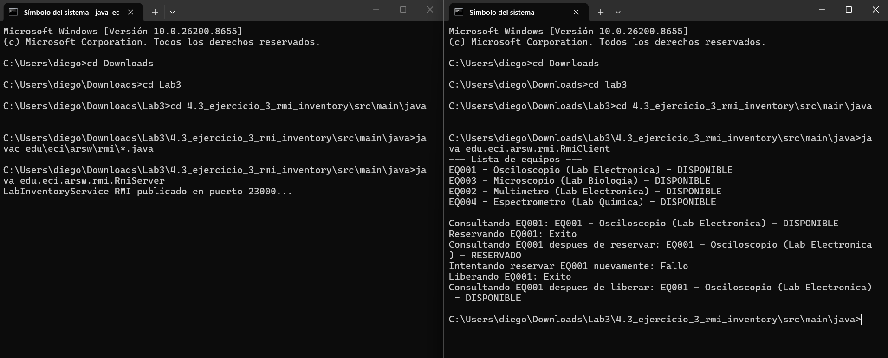

# Laboratory Inventory with Java RMI

Escuela Colombiana de Ingeniería Julio Garavito

Arquitecturas de Software - ARSW

---

## Exercise Description

This project implements the RPC (Remote Procedure Call) paradigm through Java's native RMI (Remote Method Invocation) technology. The core objective is to completely eliminate network visibility for the client developer. In previous exercises, the programmer had to build strings, send them over sockets, or make HTTP requests manually. With RMI, the client simply calls methods as if the object were in its own memory, and Java handles everything else underneath.

---

## What Was Asked

The exercise required building a system to manage university laboratory equipment inventory, such as oscilloscopes, multimeters, and computers. The server had to maintain the inventory in memory, and the remote interface had to expose four operations: querying the full equipment list, querying an equipment by code, reserving available equipment, and releasing reserved equipment. `Equipment` class objects had to be network-transmissible, which in Java requires implementing the `Serializable` interface.

---

## Project Structure

```text
4.3_ejercicio_3_rmi_inventory/
├── src/
│   └── main/
│       └── java/
│           └── edu/eci/arsw/rmi/
│               ├── Equipment.java
│               ├── LabInventoryService.java
│               ├── LabInventoryServiceImpl.java
│               ├── RmiServer.java
│               └── RmiClient.java
└── README.md
```

---

## How the Architecture Works

RMI relies on three pieces working together. The first is the Registry, a process acting as a phone directory where the server publishes its service under a name, and the client looks it up by that same name. The second is the Stub, a proxy object generated by Java and given to the client. When the client calls a method on this proxy, the Stub packages the arguments, serializes them to bytes, sends them over the network to the server, waits for the response, deserializes it, and returns it as if it were a local call. The third is the Skeleton, the server-side component that receives those bytes, unpacks them, executes the real method on the concrete object, and returns the serialized result.

The result for the client programmer is they can write a line like `service.reservarEquipo("codigo")`, and the operation occurs remotely with complete transparency.

---

## Class by Class Analysis

### Equipment

Represents physical laboratory equipment. It contains a unique code, a descriptive name, the laboratory it belongs to, and its availability status. Crucially, it implements `Serializable`. Without this signature, Java cannot convert the object to bytes to send it over the network, and any attempt to do so would throw a runtime exception.

### LabInventoryService

The system's contract interface. It extends Java's `Remote` interface, indicating to the runtime that its methods can be invoked remotely. All its declared methods must throw `RemoteException`, a checked exception Java forces developers to handle to represent any network failure that might occur during a remote call.

### LabInventoryServiceImpl

Contains the concrete implementation of all business logic. It extends `UnicastRemoteObject`, the base class that makes Java automatically export this instance and register it as an object available for remote invocation. Internally, it uses a `HashMap` to store equipment and `synchronized` methods to ensure atomic reservations and prevent race conditions.

### RmiServer

The server's entry point. It uses `LocateRegistry.createRegistry` on port 23000 to spin up the RMI directory, then uses `Naming.rebind` to publish the service instance under the name `labInventoryService`. From then on, the server listens for requests indefinitely.

### RmiClient

Looks up the remote service using `LocateRegistry.getRegistry` and `Naming.lookup` with the same name the server used to publish it. Once the Stub is obtained, the rest of the client code is practically indistinguishable from local code.

---

## How to Run

Compile all files in the package:

```bash
cd 4.3_ejercicio_3_rmi_inventory/src/main/java
javac edu/eci/arsw/rmi/*.java
```

Start the server in a terminal:

```bash
java edu.eci.arsw.rmi.RmiServer
```

In another terminal, execute the client:

```bash
java edu.eci.arsw.rmi.RmiClient
```

The client will display the complete inventory, attempt to reserve equipment, and output the operation's result.


