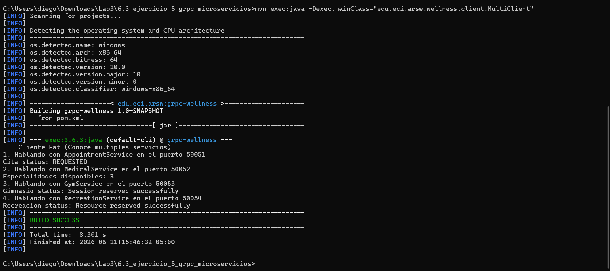

# gRPC Microservices Decomposition

Escuela Colombiana de Ingeniería Julio Garavito

Arquitecturas de Software - ARSW

---

## Exercise Description

This project demonstrates the principle of microservices decomposition applied to the university wellness system. What was a single server with a single interface in the previous exercise now becomes four completely independent servers, each responsible for a specific university domain.

The core idea is that each service can be developed, deployed, scaled, and maintained completely autonomously without affecting the others.

---

## What Was Asked

The exercise required taking the wellness system from the previous exercise and decomposing it into four independent microservices: `AppointmentService` for appointment management, `MedicalService` for the medical area, `GymService` for the university gym, and `RecreationService` for recreational and cultural activities. Each had to have its own `.proto` contract, its own server running on a different port, and its own isolated business logic. Additionally, it had to demonstrate the problem this creates for the client, which now needs to know the address and port of each microservice separately.

---

## Project Structure

```text
6.3_ejercicio_5_grpc_microservicios/
├── src/
│   └── main/
│       ├── proto/
│       │   ├── appointment.proto
│       │   ├── medical.proto
│       │   ├── gym.proto
│       │   └── recreation.proto
│       └── java/
│           └── edu/eci/arsw/wellness/
│               ├── appointment/
│               │   └── AppointmentServer.java
│               ├── medical/
│               │   └── MedicalServer.java
│               ├── gym/
│               │   └── GymServer.java
│               ├── recreation/
│               │   └── RecreationServer.java
│               └── client/
│                   └── MultiClient.java
├── pom.xml
└── README.md
```

---

## How the Architecture Works

Each microservice is a completely independent Java process. They don't share memory, they don't share objects, and they don't call each other. The only way they could communicate, if necessary, would be over the network using their own gRPC channels.

The `AppointmentServer` listens on port 50051, the `MedicalServer` on 50052, the `GymServer` on 50053, and the `RecreationServer` on 50054. Each has its own `.proto` file defining an independent contract. If the team working on the medical service decides to change the message structure of a medical consultation, that change absolutely does not affect the gym service's contract.

The problem this exercise deliberately exposes is that of the heavy client or Fat Client. The `MultiClient` must instantiate a separate channel pointing to each address and port, and handle each stub independently. If tomorrow the `GymService` moves to another server or changes ports, the client code must be updated. This is what the API Gateway in the next exercise aims to resolve.

---

## Class by Class Analysis

### The four .proto files

Each file isolates its own service and its own messages. This separation is a deliberate design decision implementing the Single Responsibility Principle at the architectural level. A change in `gym.proto` does not require recompiling or reimplementing the medical area code.

### The four servers

`AppointmentServer`, `MedicalServer`, `GymServer`, and `RecreationServer` follow exactly the same structure: they create a gRPC `Server` on their assigned port, register their service implementation, and listen. Each is an autonomous Java process with its own `main` method.

### MultiClient

It is intentionally cumbersome to demonstrate the anti-pattern. It creates multiple `ManagedChannel`s, each pointing to a different port, and operates with a different stub for each service. In a real application, this means the university frontend needs to know the backend's internal network topology, which violates the encapsulation principle at the system level.

---

## How to Run

Compile the project with Maven:

```bash
cd 6.3_ejercicio_5_grpc_microservicios
mvn clean compile
```

Open four terminals and run each server independently:

```bash
# Terminal 1
mvn exec:java -Dexec.mainClass="edu.eci.arsw.wellness.appointment.AppointmentServer"

# Terminal 2
mvn exec:java -Dexec.mainClass="edu.eci.arsw.wellness.medical.MedicalServer"

# Terminal 3
mvn exec:java -Dexec.mainClass="edu.eci.arsw.wellness.gym.GymServer"

# Terminal 4
mvn exec:java -Dexec.mainClass="edu.eci.arsw.wellness.recreation.RecreationServer"
```

With all servers running, execute the client in a fifth terminal:

```bash
mvn exec:java -Dexec.mainClass="edu.eci.arsw.wellness.client.MultiClient"
```
