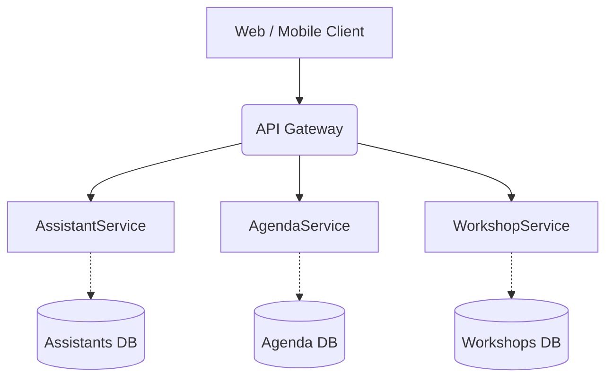

# ECICIENCIA Platform - Architectural Design

## 1. Architecture Diagram (Microservices + API Gateway)

Below is the proposed architecture using Mermaid. A microservices pattern connected through an API Gateway was chosen.

## 2. Microservices and Responsibilities

| Service | Responsibility |
|----------|----------------|
| **AssistantService** | Manage registration and personal data of attendees to the ECICIENCIA event. |
| **AgendaService** | Manage the general list of activities, allowing users to query talks and events by time slot. |
| **WorkshopService** | Control the reservation of specific spots for interactive workshops and monitor capacity in real-time. |

## 3. Gateway Description

The **API Gateway** centralizes requests from front-end applications (web and mobile).
Instead of the client having to connect to three services on different ports (and handling authentication/routing on the client side), the Gateway exposes a unified REST or GraphQL interface to the outside world, and communicates internally with the microservices using gRPC.

## 4. Justification (Why not a monolithic service?)

If we built ECICIENCIA as a monolith:
1. **Scalability:** If thousands of users are querying the agenda on the day of the event, the entire monolith must be scaled, even if almost no one is registering as a new attendee. With microservices, we can scale only the `AgendaService`.
2. **Resilience:** If workshop reservation crashes due to concurrency or a code failure, in a monolith the entire system would go down (the agenda couldn't be viewed either). In microservices, the system degrades gracefully (people can still see the agenda even if they can't reserve workshops).
3. **Independent Deployment:** Different teams can improve the "Workshops" module and deploy it without affecting or stopping the "Attendee Registration".

## 5. Final Reflection on Architecture Evolution

Through this workshop, I have seen how a simple network model (TCP Sockets) requires a massive effort to define semantics, error control, and data structure ("MOVIE:1"). HTTP alleviated part of the structure through verbs (GET, POST) and standardized routes, but still didn't offer clean method invocation.

With Java RMI, I understood the power of RPC: invoking functions on a server as if they were locally in memory. However, its extreme tie to Java restricts modern interoperability. That's where gRPC shines, offering a language-agnostic contract (the `.proto`), strong typing, and high serialization speed through Protocol Buffers.

Finally, moving from gRPC to Microservices and an API Gateway, it's understood that architecture is not just about "how data travels," but how domains (Bounded Contexts) are logically organized. Separating the wellness system into `Medical`, `Gym`, `Recreation` allows each component to scale separately, while the Gateway hides this operational complexity from the end user. Distributed architectures are not a trend, but a set of essential tools for solving the natural complexity of evolving systems.
