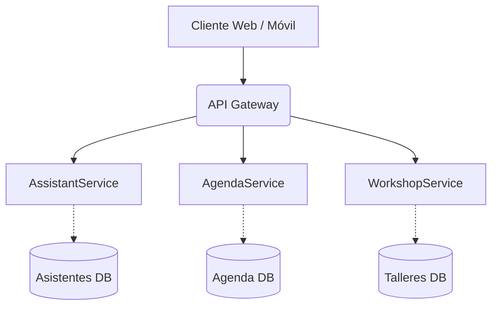

# Plataforma ECICIENCIA - Diseño Arquitectónico

## 1. Diagrama de Arquitectura (Microservicios + API Gateway)

A continuación, se presenta la arquitectura propuesta usando Mermaid. Se optó por un patrón de microservicios conectados a través de un API Gateway.

## 2. Microservicios y Responsabilidades

| Servicio | Responsabilidad |
|----------|----------------|
| **AssistantService** | Gestionar el registro y datos personales de los asistentes al evento ECICIENCIA. |
| **AgendaService** | Administrar la lista de actividades generales, permitiendo consultar charlas y eventos por franja horaria. |
| **WorkshopService** | Controlar la reserva de cupos específicos para los talleres interactivos y monitorear el aforo en tiempo real. |

## 3. Descripción del Gateway

El **API Gateway** centraliza las peticiones de las aplicaciones front-end (web y móvil).
En lugar de que el cliente deba conectarse a tres servicios en diferentes puertos (y manejar la autenticación/ruteo en el cliente), el Gateway expone una interfaz REST o GraphQL unificada hacia el exterior, y se comunica internamente con los microservicios usando gRPC.

## 4. Justificación (No a un servicio monolítico)

Si construyéramos ECICIENCIA como un monolito:
1. **Escalabilidad:** Si el día del evento hay miles de usuarios consultando la agenda, el monolito completo debe escalarse, incluso si casi nadie se está registrando como asistente nuevo. Con microservicios, podemos escalar únicamente el `AgendaService`.
2. **Resiliencia:** Si la reserva de talleres colapsa por concurrencia o una falla de código, en un monolito todo el sistema se caería (no se podría ver ni la agenda). En microservicios, el sistema se degrada graciosamente (la gente sigue viendo la agenda aunque no pueda reservar talleres).
3. **Despliegue independiente:** Equipos diferentes pueden mejorar el módulo de "Talleres" y desplegarlo sin afectar ni detener el "Registro de asistentes".

## 5. Reflexión Final sobre la Evolución de la Arquitectura

A través de este taller, he evidenciado cómo un simple modelo de red (Sockets TCP) requiere un esfuerzo gigantesco para definir la semántica, control de errores y estructura de la información ("MOVIE:1"). HTTP alivianó parte de la estructura mediante verbos (GET, POST) y rutas estandarizadas, pero seguía sin ofrecer una invocación limpia de métodos.

Con Java RMI entendí el poder de RPC: invocar funciones en un servidor como si estuvieran localmente en memoria. Sin embargo, su atadura extrema a Java restringe la interoperabilidad moderna. Es allí donde brilla gRPC, ofreciendo un contrato agnóstico al lenguaje (el `.proto`), tipado fuerte y alta velocidad de serialización mediante Protocol Buffers.

Finalmente, al avanzar de gRPC hacia Microservicios y un API Gateway, se comprende que la arquitectura no solo se trata de "cómo viajan los datos", sino de cómo se organizan lógicamente los dominios (Bounded Contexts). Separar el sistema de bienestar en `Medical`, `Gym`, `Recreation` permite escalar cada componente por separado, mientras el Gateway oculta esta complejidad operativa del usuario final. Las arquitecturas distribuidas no son una moda, sino un conjunto de herramientas esenciales para resolver la complejidad natural de sistemas que evolucionan.
